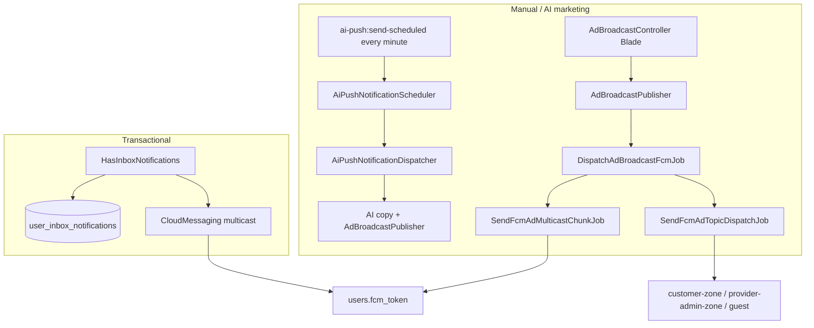

# Clean365 Notifications & Push (Tashyik port)

Port of Tashyik’s CloudMessaging, transactional inbox, AdBroadcast marketing FCM, and scheduled AI push — adapted to Clean365 models, Firebase, and zones.

**Existing Clean365 path is unchanged:** `device_notification()` / `topic_notification()` and PromotionManagement **Send Notifications** (`PushNotification` + `customer-{zone_id}` topics) still work.

**Stack:** `user_inbox_notifications` + Kreait `kreait/firebase-php` via `app('firebase.messaging')` (`App\Providers\FirebaseServiceProvider`). Credentials come from `business_config('push_notification', 'third_party')->live_values['service_file_content']`. There is **no** `kreait/laravel-firebase` / Firebase facade.

**Scheduling:** `bootstrap/app.php` `withSchedule` — `ai-push:send-scheduled` every minute.

---

## Tashyik → Clean365 map

| Tashyik | Clean365 |
|---------|----------|
| `App\Models\User` | `Modules\UserManagement\Entities\User` |
| `users.ui_locale` | None — `config('app.locale')` / `en` / `ar` via `NotificationLocale` |
| `users.city_id` / `city_ids` | Zones: `ad_broadcasts.zone_ids` (JSON UUIDs). Users have **no** `zone_id`; customers use `user_zones`, providers `Provider.zone_id` |
| Audiences `customers`, `service_providers`, `guests` | `customers`, `providers`, `servicemen`, `guests` → `user_type` `customer` / `provider-admin` / `provider-serviceman` |
| Topics `customer`, `service_provider`, `guest` | Zone-scoped: `customer-{zone_id}`, `provider-admin-{zone_id}`, `provider-serviceman-{zone_id}`. Global (no zones): `customer` / `provider-admin` / `provider-serviceman` / `guest` |
| `notifications` table | `user_inbox_notifications` (avoids Laravel `notifications`) |
| `HasNotifications` | `App\Traits\HasInboxNotifications` |
| `Settings` AI columns | `BusinessSettings` `key_name=ai_push_settings`, `settings_type=notification_config` (`App\Services\AiPush\AiPushSettings`) |
| Livewire Push Ads | Blade: PromotionManagement admin Ad Broadcasts |
| `Firebase::messaging()` | `app('firebase.messaging')` |

---

## Architecture

---

## 1. Two notification channels

| Channel | Model | Push? | Purpose |
|---------|-------|-------|---------|
| In-app / transactional | `App\Models\UserInboxNotification` | Optional FCM to `users.fcm_token` | Order lifecycle, etc. (opt-in via trait) |
| Marketing / AI ads | `App\Models\AdBroadcast` | FCM tokens + topics | Admin compose + scheduled AI |
| Legacy zone campaigns | `PushNotification` | `topic_notification()` | Existing Send Notifications UI |

### Transactional path

`HasInboxNotifications::sendNotification()`:

1. Save a `user_inbox_notifications` row (`User::inboxNotifications()`).
2. If push is on and a title key exists for app locale (`en` then `ar` then first key) and `fcm_token` is set → `CloudMessaging`.

**Booking lifecycle (dual channel):** existing `device_notification()` still sends FCM via HTTP v1. It now also writes a `user_inbox_notifications` row when a `user_id` is passed (or when the token maps to a user). Booking observers pass customer / provider-owner / serviceman user ids.

**API inbox:** `GET …/inbox-notifications` (+ `/{id}`) on customer, provider, and serviceman auth routes.

### Marketing / AI path

1. `AdBroadcastPublisher` creates `ad_broadcasts`.
2. `DispatchAdBroadcastFcmJob` batches:
   - **No zones:** token multicast (`SendFcmAdMulticastChunkJob`) + optional global topics.
   - **With `zone_ids`:** topic jobs only (`customer-{zone_id}`, …). Token multicast is skipped because `users` has no `zone_id`; geo targeting is the same topic pattern as existing push-notification.
3. Optional inbox rows via `AdBroadcastInAppNotifier`.
4. Clients ack via `POST /api/v1/broadcasts/ack` (also under customer/provider/serviceman auth prefixes).

---

## 2. Automatic AI push

**Host crontab:** `* * * * * php /path/to/artisan schedule:run`

**Every minute:** `ai-push:send-scheduled`

| Piece | Location |
|-------|----------|
| Schedule | `bootstrap/app.php` — `everyMinute()`, `withoutOverlapping(2)`, `runInBackground()` |
| Command | `app/Console/Commands/SendScheduledAiPushNotificationCommand.php` |
| Settings | `AiPushSettings` → BusinessSettings JSON |
| Copy | Gemini (`Modules\BlogModule\Services\Gemini\GeminiVertexClient`) then OpenAI (`OPENAI_API_KEY`) |
| Queue job | `ProcessScheduledAiPushJob` when `AI_PUSH_RUN_SYNC=false` (default) |

Frequencies match Tashyik: interval (`every_1_minute` …) and clock (`daily` … `monthly`) with `AI_PUSH_SLOT_GRACE_MINUTES` (default 30).

Admin UI: **Notification Management → Ad Broadcasts**.

---

## 3. Ops

1. Cron: `php artisan schedule:run` every minute  
2. Queue worker for AdBroadcast batches and (by default) AI push  
3. Firebase service account in Business Settings (third-party push notification)  
4. Gemini and/or `OPENAI_API_KEY` for AI copy  

| Env (selected) | Purpose |
|----------------|---------|
| `FIREBASE_SECONDARY_CREDENTIALS` | Optional secondary / iOS fallback |
| `AD_BROADCAST_*` | Chunk size, rate limits, locales, topic vs token prefs |
| `AI_PUSH_RUN_SYNC` | Default `false` → queue AI job |
| `AI_PUSH_SLOT_GRACE_MINUTES` | Stale clock slot skip |

Configs: `config/ad_broadcast.php`, `config/services.php` (`firebase_dashboard_push`), `config/filesystems.php` (`ad-media`).

---

## 4. API ack

Authenticated Passport users:

- `POST /api/v1/broadcasts/ack`
- `POST /api/v1/customer/broadcasts/ack`
- `POST /api/v1/provider/broadcasts/ack`
- `POST /api/v1/serviceman/broadcasts/ack`

Body: `{ "send_id": "<uuid>", "event": "opened"|"delivered" }`.
